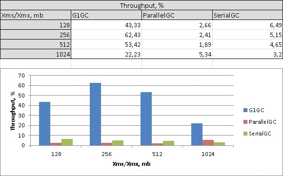

##Описание
Были проведены замеры трех сборщиков мусора: G1GC,  ParallelGC и SerialGC при разных объемах доступной памяти: 128mb, 256mb, 512 mb, 1024mb. Анализ логов работы сборщика мусора производился с помощью инструмента GCeasy (https://gceasy.io/). Ниже представлена сравнительная статистика:

***Throughput***  

***Average pause***  

***Max pause***  

Как видно из графиков, производительность в большей степени зависит от объема используемой памяти (ожидаемо) и от типа сборщика мусора. Это касается и показателя throughput, который характеризует отношение времени, затраченного приложением на полезную работу, ко времени, затраченному на работу сборщика мусора, и показателя average pause time, характеризующего среднюю длительность остановок приложения, и показателя max pause time, который, в свою очередь, показывает наиболее длительные остановки, для каждого сборщика мусора.

##Вывод
С точки зрения выбора типа сборщика мусора, очевидно, что наиболее эффективным является G1GC. При прочих равных, он показывает намного больший throughput. В то же время, у него наименьшая средняя длительность остановок и его максимальная по времени остановка также меньше чем у конкурентов.
Также стоит отметить, что сравнивая ParallelGC и SerialGC при малых объемах используемой памяти (128mb, 256mb) SerialGC показывает менее длительные средние и максимальные остановки чем ParallelGC. С ростом используемой памяти (512mb, 1024mb) ParallelGC начинает превосходить SerialGC по вышеприведенным показателям. Похожая ситуация прослеживается и с показателем throughput: при малых объемах памяти (128mb, 256mb, 512 mb) выигрывает  SerialGC, однако, при объеме памяти 1024mb throughput у ParallelGC становится больше чем у SerialGC.
